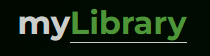

<h1 align="center">
   
  </a>
   
</h1>

<h4 align="center">Your digital library</h4>

Collect all your finished books

<h4 align="center"> <a href="https://nikislibrary.netlify.app/" target="_blank">Click to see the project</a> </h4>
<h4 align="center">

</h4>

## Key Features

* Made in React.js
* Possibility of register/login (Firebase)
* CRUD for read books
* Motivation system due to quantity of books on the shelf
* RWD
* Styled in SCSS, BEM
* Icons from Font awesome

  
## How To Use
This project was bootstrapped with [Create React App](https://github.com/facebook/create-react-app).

## Available Scripts

In the project directory, you can run:

### `npm start`

Runs the app in the development mode.\
Open [http://localhost:3000](http://localhost:3000) to view it in your browser.
